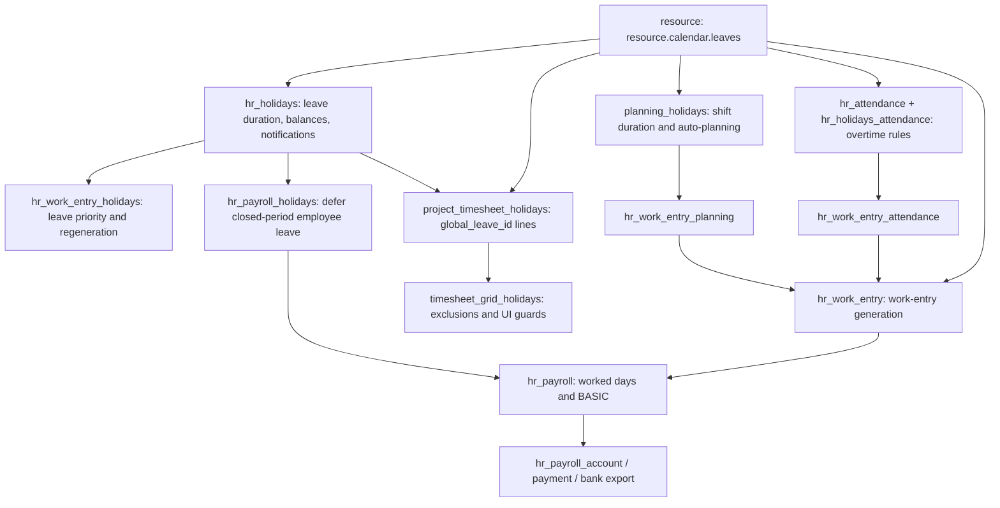

# Public Holidays — Complete Cross-Module Flow and Safety Audit

> **Updated by Codex on 2026-07-12 after a multi-agent, source-level audit of Odoo 19 Community, Enterprise, tests, and the payroll-related custom modules in this workspace.**
>
> This is the canonical public-holiday document. Topic documents link here for the full lifecycle.

## Executive verdict

Odoo's public-holiday model is simple, but its effects are not. One `resource.calendar.leaves` row can change employee leave balances, work entries, overtime, Planning hours, Timesheets, draft payslips, accruals, and employee notifications. Stock behavior also contains gaps around retroactive edits, multi-company work-entry generation, validated records, and Planning regeneration.

The safe customization policy is:

1. Configure Georgian holidays centrally and before work-entry generation.
2. Use one dedicated paid Georgian work-entry type and validate its live configuration.
3. Treat public-holiday create, move, type/calendar change, and delete as payroll-sensitive operations.
4. Block changes whose old or new interval touches validated work entries or validated/paid payslips until a controlled correction is opened.
5. Regenerate unvalidated work entries and recompute affected draft payslips explicitly.
6. Test calendar, attendance, and planning sources separately; they do not behave the same.

## Module and data-flow map



Important dependency facts:

- `hr_work_entry_holidays` auto-installs with Time Off + Work Entries.
- `hr_payroll_holidays` auto-installs with Time Off Gantt + the holidays/work-entry bridge + Payroll.
- `hr_work_entry_attendance` and `hr_work_entry_planning` add alternative work-entry sources.
- `hr_payroll_attendance` and `hr_payroll_planning` add payroll-facing behavior for those sources.
- `project_timesheet_holidays` auto-installs with Time Off + Timesheets; `timesheet_grid_holidays` adds enterprise validation/grid exclusions.
- There is no stock timesheet-to-payroll earnings bridge.

## Canonical record and scope

A public holiday is a `resource.calendar.leaves` row with `resource_id=False`. It is not an `hr.leave` request and has no employee approval state.

| Field | Actual meaning |
|---|---|
| `company_id` | Stored, readonly, computed from the selected calendar or current company |
| `calendar_id=False` | All schedules in that company, not all database companies |
| `calendar_id` set | Only that working schedule |
| `date_from/date_to` | Naive UTC datetimes in storage |
| `time_type` | Defaults to `leave`; hidden in the normal Public Holidays list |
| `work_entry_type_id` | Payroll classification added by `hr_work_entry`; optional at model level |
| `elligible_for_accrual_rate` | Defaults false; controls worked-time accrual treatment, not payroll pay rate |

Core definitions: [`resource_calendar_leaves.py`](../addons/resource/models/resource_calendar_leaves.py), Time Off extension: [`resource.py`](../addons/hr_holidays/models/resource.py), payroll type field: [`resource_calendar_leaves.py`](../addons/hr_work_entry/models/resource_calendar_leaves.py).

### Company and calendar rules

- Switch to the intended current company before creating an All Schedules holiday. Stock views hide the company in the main list and hide it on the form when no calendar is selected.
- The resource-calendar interval engine applies a global leave only when the resource and leave companies match.
- Different calendar-specific holidays may overlap. An All Schedules row conflicts with any overlapping calendar-specific row in the company; same-calendar rows also conflict.
- The overlap guard is a Python constraint, not a database exclusion constraint. Concurrent creates can race, and touching inclusive endpoints are rejected.
- `date_from == date_to` is accepted by the base constraint. The customization should reject zero-duration records.

### Timezone rules

The stock behavior is asymmetric:

- Initial defaults use the selected/company calendar timezone.
- On create, `hr_holidays` explicitly reinterprets entered wall time in the selected calendar timezone only when `calendar_id` is set.
- All Schedules records skip that conversion.
- Write does not repeat the conversion.

Therefore, use All Schedules only when affected calendars share the intended civil timezone and the stored/local bounds have been verified. Use calendar-specific records where timezones differ. Tests must cover Asia/Tbilisi versus UTC users, create versus write, imports/API, DST calendars, and local-midnight boundaries.

## Public-holiday CRUD lifecycle

Create, write, and unlink run two separate flows.

### Flow A — employee leave reevaluation happens immediately

`hr_holidays` calls `_reevaluate_leaves` for every global public-holiday change. It searches all overlapping non-refused/non-cancelled employee leaves in the company—without first limiting to an applicable working calendar—then:

1. recomputes leave duration;
2. temporarily writes the leave back to `confirm`;
3. restores its previous state;
4. recreates resource rows for validated leaves;
5. notifies employees when days are returned or consumed; and
6. auto-refuses a leave that no longer fits its allocation.

Source: [`resource.py`](../addons/hr_holidays/models/resource.py).

This can indirectly reach payroll: auto-refusal enters `hr_work_entry_holidays.action_refuse()`, whose regeneration can deactivate linked work entries, including validated ones. Consequently, a retroactive public-holiday change can affect an already-paid period even though public-holiday CRUD itself does not directly regenerate work entries.

### Flow B — existing work entries are not rebuilt

Normal work-entry generation only extends the generated range at its beginning or end. It does not revisit a date in the middle. Public-holiday create/write/unlink has no direct work-entry regeneration hook.

| Situation | Safe action |
|---|---|
| Holiday is outside the generated range | Later normal generation will see it |
| Inside generated range; all entries unvalidated | Regenerate affected employees/dates, then Recompute Whole Sheet on draft slips |
| Any affected entry is validated or slip is validated/paid | Block the change and use a controlled payroll correction |
| Holiday moved/deleted without regeneration | Old holiday entries remain stale |

The normal regeneration wizard excludes an employee from the whole selected range if any validated work entry exists in that range. Internal `slots=` callers bypass this user-facing check and force generation; validated rows survive, while replacements can become conflicts.

## Employee time off, balances, and accruals

Public-holiday work-entry priority and employee leave balance are independent decisions.

- Default `include_public_holidays_in_duration=False`: the public holiday is excluded from the employee's leave duration and allocation consumption.
- When true, despite the confusing UI label “Ignore Public Holidays,” the public-holiday hours/days are included and consume the employee leave allocation.
- Work-entry priority can still select the public-holiday type. Localization bypass codes change work-entry type priority, not the balance flag.
- Toggling this leave-type flag has incomplete recomputation coverage for existing leaves outside the current-year check. Use an explicit migration/recompute process.

Worked-time accrual has another independent flag: public holidays default to `elligible_for_accrual_rate=False`, so worked-time-based accrual normally subtracts them. If Georgian policy says paid public holidays earn accrual, set/audit this field explicitly and test the policy. The Georgian work-entry type does not control it.

Changing calendar attendances or timezone does not reevaluate stored `hr.leave` durations. Regenerating work entries alone is not enough after a retroactive schedule edit.

### Late employee leave and public-holiday overlap

`hr_payroll_holidays` handles an employee leave approved after a regular payslip is validated/paid:

- the leave becomes `payslip_state='blocked'` and is excluded from closed-period work-entry generation;
- payroll can “Report to Next Month,” which rewrites/splits future draft WORK100 entries into the leave type;
- public-holiday overlap is not deferred a second time—only the non-public-holiday part is carried;
- a custom daily worker therefore receives the deferred leave classification on the future replacement date, not by rewriting the historical day.

There is an apparent v19 hook typo: the bridge defines `_error_dependencies`, while base payroll uses `_issues_dependencies`. Do not assume the blocked-leave issue refreshes reactively; force a regression around compute/refresh and confirmation.

## Work-entry source matrix

### Calendar source

The scheduled attendance interval is removed and replaced by the public-holiday type. A fixed-calendar non-working day normally produces no payable holiday entry.

Badge records do not become base work entries for a calendar-source employee. If attendance overtime is enabled and a ruleset creates approved paid overtime lines, overtime work entries can be added on top of the full holiday base. With no ruleset, badge hours add nothing to payroll work entries.

### Attendance source

Closed badge intervals are the base attendance source. Badge intervals overlapping a leave are subtracted from the leave interval and become WORK100 or approved overtime according to the attendance bridge. Open attendances are ignored.

Flexible calendars need their own test: an upstream case produces an 8-hour public-holiday entry plus 4 badge hours. Do not infer fixed-calendar behavior for flexible schedules.

### Planning source

Published Planning slots are the base source, but public-holiday replacement duration is intersected with the static working calendar. A shift on a static non-working day can be removed while producing zero holiday hours. Any mismatch between planned shifts and the static schedule therefore needs an explicit business policy.

`planning_holidays` also changes allocated hours and auto-planning, but two stock gaps are relevant:

- Its public-holiday `write()` watches nonexistent `start_datetime/end_datetime` keys instead of `date_from/date_to`, so moving/resizing a holiday may leave `planning.slot.allocated_hours` stale.
- Editing a published slot's resource/date/hours does not regenerate its work entries unless state changes; falsy changes such as `allocated_hours=0` can also bypass validated-entry guards.

Calendar, attendance, and planning sources must be separate test rows; “the employee has Attendances installed” is not a source definition.

## Payroll calculation

The payroll chain is:

```text
public holiday
  -> hr.work.entry (date, duration, work_entry_type_id)
  -> hr.payslip.worked_days (hours/days/type)
  -> worked-day amount
  -> BASIC salary rule sums paid_amount
```

For a valid paid holiday type:

- Monthly: the holiday replaces non-extra scheduled hours. At 100% it preserves the monthly wage denominator and total.
- Hourly: scheduled holiday hours pay `hourly_wage × hours × amount_rate`.
- A type included in `structure.unpaid_work_entry_type_ids` pays zero regardless of its name or `is_leave` flag.
- Payslip calculation reads the live `hr.work.entry.type.amount_rate`; the copied rate on `hr.work.entry` is not the worked-days source. Editing the type can change a refreshed draft retroactively.
- Missing `work_entry_type_id` produces a conflict work entry. Batch payslip generation blocks conflicts; an individual flow can silently exclude them, so customization needs its own blocker before compute and confirmation.

Recommended Georgian type:

```text
Name: Public Holiday
Code: GE_PUBLIC_HOLIDAY
Country: Georgia
is_leave: True
is_extra_hours: False
amount_rate: 1.0
active: True
```

It must not be present in any applicable structure's unpaid types. The source fingerprint must include the public-holiday rows, calendar schedule/timezone, live type fields, and unpaid-type mappings—not only existing work entries.

Worked-days display naming has a lower-risk timezone bug: holiday matching compares the holiday's UTC start date with local work-entry dates and only uses the start date. The label can be generic for near-midnight or multi-day records even when money is correct.

## Attendance overtime and double-pay policy

Odoo has no universal built-in public-holiday premium. It can, however, generate one automatically when a configured attendance overtime ruleset has a paid timing/quantity rule such as `timing_type='leave'` or non-working-day logic.

Before enabling custom work logs, inventory every employee's ruleset and answer:

- Does native attendance already create a paid overtime work entry for holiday badge time?
- Does the custom record represent the full worked-hour amount or only the premium?
- Is the base hour already paid through holiday base pay, WORK100, overtime, or timesheets?

The custom module must block or deduct collisions. A blanket `hours × rate × percentage` can double-pay both base and premium.

## Timesheet lifecycle

When Time Off + Timesheets are installed and the company has an internal project/task:

- Validated employee leave creates analytic lines linked by `holiday_id`.
- Public holidays create one line per employee/calendar/working day linked by `global_leave_id`.
- Holiday/leave edits and cancellations delete and regenerate those lines in sudo.
- Employee/calendar lifecycle hooks can generate missing future holiday lines.
- `timesheet_grid_holidays` excludes both link fields from overtime queries and reminders, and protects the Time Off grid/timer paths.

These lines start draft, but stock Timesheet validation can still validate them. Later holiday regeneration deletes them without recomputing `employee.last_validated_timesheet_date`, potentially leaving earlier timesheets locked.

The optional payroll-timesheet bridge must:

1. exclude `holiday_id` and `global_leave_id` from payroll eligibility;
2. exclude them from any custom auto-validation selection;
3. never use internal Time Off lines as payable worked timesheets;
4. test holiday edits after accidental/standard validation; and
5. repair/recompute validation boundaries if such lines already exist.

## Security and operator UX

- All internal users can read global public holidays after `hr_holidays` loads.
- Time Off Officers have underlying unrestricted CRUD through an `hr_holidays` rule.
- The central Public Holidays menu is shown only to Time Off Administrators, but hiding a menu is not a security boundary.
- Stock list/form views make company verification difficult for All Schedules rows.
- The calendar smart-button/count is not a reliable control report for All Schedules holidays.

Customization should provide one controlled admin action with visible company, calendar scope, local date/time, payroll type, accrual eligibility, impact preview, and affected draft/validated periods. Server methods and record rules must enforce the change policy.

Do not confuse Public Holidays with “Generate Time Off / Multiple Requests.” That wizard creates real `hr.leave` requests per employee, uses allocations/approvals, and has different payroll consequences.

## Confirmed stock safety gaps to guard in customization

| Risk | Stock behavior | Required guard |
|---|---|---|
| Retroactive holiday CRUD | Reevaluates/auto-refuses leave but leaves work entries stale | Old+new interval impact check; block validated/paid; explicit regeneration |
| Multi-company work-entry generation | `_get_leave_domain` uses all enabled companies and pairing lacks exact company check | Exact version-company filter and regression with both companies enabled |
| New attendance in generated period | Can archive overlapping predecessors, including validated rows | Reject create/close inside validated/paid window |
| New published Planning slot | Can archive all touched work entries, including validated rows | Reject create/publish inside validated/paid window |
| Published slot edit | Non-state edit can leave work entries stale | Regenerate old+new spans; protect falsy changes |
| Holiday edit in Planning | `planning_holidays.write` watches wrong field names | Override for `date_from/date_to/calendar/resource` and recompute shifts |
| Public-holiday overlap | Python-only check races | Serialize/advisory lock or database-safe exclusion strategy |
| All Schedules timezone | No explicit calendar timezone conversion | Restrict to one civil timezone or create per-calendar rows |
| Calendar schedule edit | Stored leave durations are not reevaluated | Block retroactive edits or run explicit leave recomputation |

## Custom payroll correction and downstream accounting

Custom work-log/timesheet claims require lineage-aware correction semantics. Stock `correct_sheet()`:

1. copies the original slip into an edited negative refund, including the original custom salary-rule amounts; and
2. creates/recomputes an origin-linked correction slip.

If correction slips are simply excluded from claims, the refund removes the original custom pay while the correction fails to restore it. The correction must mirror the original claim snapshots through an immutable claim ledger/reference to the origin; it must not steal newly approved records. Late records should roll to the next regular slip.

Downstream custom integration also needs testing: `basis_bank` filters selected sendable payslips, but in shared payroll-move mode it passes all lines of the shared journal entry to payment registration. Test mixed employees, zero/negative/cancelled slips, and selected subsets, or require per-slip moves for bank export.

## Required regression matrix

At minimum, automate:

- source × badge × ruleset × holiday: calendar/attendance/planning; none/partial/full/open badge; no/pending/approved/refused rules; full/partial holiday;
- monthly/hourly/custom daily exact work entries, worked-day amounts, BASIC, overtime, and net;
- leave overlap with `include_public_holidays_in_duration` false/true and localization bypass priority;
- accrual with public-holiday eligibility false/true;
- create, move, type/calendar change, and delete outside generation, in unvalidated generation, and across validated/paid periods;
- sufficient/insufficient allocation, notifications, auto-refusal, and preservation of validated entries;
- UTC versus Asia/Tbilisi creators; All Schedules/calendar-specific; create/write/import/API/DST;
- two enabled companies and exact holiday isolation in work entries, payslips, and employee UI;
- Planning static-schedule mismatch, holiday move, slot move/resize/reassign/zero-hours;
- new attendance and new published shift inside validated periods;
- holiday/global leave timesheet generation, validation, regeneration, payroll exclusion, and validation-boundary repair;
- correction/refund claim lineage and accounting reversal;
- shared versus per-slip payroll moves through Basis Bank.

## Operator runbook

1. Switch to the target company and verify company is visibly correct.
2. Create holidays before work-entry generation; use All Schedules only for one intended civil timezone.
3. Verify name, nonzero interval, calendar scope, local/UTC bounds, `GE_PUBLIC_HOLIDAY`, accrual policy, and overlap.
4. Preview affected employee leaves, work entries, draft slips, validated/paid slips, Planning shifts, and generated Time Off timesheets.
5. Block the change if any validated/paid period is affected; open the correction procedure first.
6. Save; review employee leave state/balance changes and auto-refusals.
7. Regenerate affected unvalidated work entries using the exact date range.
8. Recompute Whole Sheet for every affected draft payslip and verify worked days, BASIC, overtime, inputs, net, and accounting preview.
9. Verify custom claim fingerprint and no holiday/time-off timesheet entered payroll eligibility.
10. Only then validate payroll and send downstream payments.

## Related documents

- [`resource_calendars.md`](resource_calendars.md)
- [`hr_holidays.md`](hr_holidays.md)
- [`work_entries.md`](work_entries.md)
- [`attendance_work_entry.md`](attendance_work_entry.md)
- [`hr_payroll.md`](hr_payroll.md)
- [`timesheets.md`](timesheets.md)
- [`payroll_wage_types.md`](payroll_wage_types.md)
- [`../PAYROLL_WAGE_TYPES_PLAN.md`](../PAYROLL_WAGE_TYPES_PLAN.md)
